# AWS Site-to-Site VPN (Static Routing) — Hands-On Lab

This project simulates a **Site-to-Site VPN connection** between an AWS VPC and an on-premises data center, using two AWS regions to stand in for "AWS" and "on-prem." It uses **static routing** and **Libreswan** as the VPN software, and demonstrates secure private connectivity between two networks over the public internet using IPSec.

## What This Project Demonstrates

- Setting up a Virtual Private Gateway (VGW) and Customer Gateway (CGW) in AWS
- Establishing an IPSec Site-to-Site VPN connection using static routes
- Configuring an open-source VPN endpoint (Libreswan) on an EC2 instance to simulate an on-prem router
- Updating route tables and security groups to allow cross-network traffic
- Verifying end-to-end private connectivity between two isolated networks

## Architecture Overview

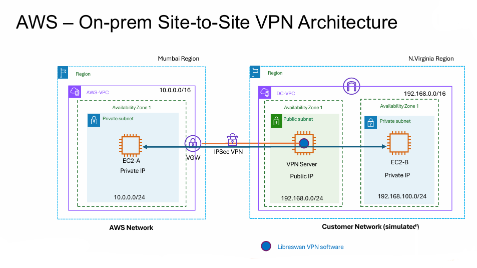

To simulate a real-world scenario without needing physical on-prem hardware, this lab uses **two AWS regions**:

| Component | Region | Role |
|---|---|---|
| **AWS-VPC** (`10.0.0.0/16`) | Mumbai (`ap-south-1`) | Represents the AWS side of the network |
| **EC2-A** | Mumbai, private subnet (`10.0.0.0/24`) | A private server inside AWS |
| **DC-VPC** (`192.168.0.0/16`) | N. Virginia (`us-east-1`) | Simulates the on-premises data center |
| **DC-VPN Server** | N. Virginia, public subnet (`192.168.0.0/24`) | Simulated on-prem router running Libreswan |
| **EC2-B** | N. Virginia, private subnet (`192.168.100.0/24`) | A private server inside the "on-prem" network |

**Traffic flow:** `EC2-A (AWS)` ⇄ `VGW` ⇄ `IPSec VPN Tunnel` ⇄ `DC-VPN Server (Libreswan)` ⇄ `EC2-B (simulated on-prem)`

> In a real-world deployment, the "DC-VPC" side would be an actual on-premises data center with its own router/firewall running IPSec — here we simulate that using a second AWS region and an EC2 instance running Libreswan.

## Prerequisites

- An AWS account with access to two regions (e.g., Mumbai and N. Virginia)
- Basic familiarity with the AWS Console (VPC, EC2)
- An SSH client to connect to EC2 instances
- No prior VPN experience required — this guide walks through every step

## Step-by-Step Setup

### Step 1: Create the AWS-side VPC (Mumbai)
- Create a VPC `AWS-VPC` with CIDR `10.0.0.0/16`
- Add one **private subnet** `10.0.0.0/24`
- Launch **EC2-A** (Amazon Linux 2023) in this subnet with a **private IP only** (no public IP)
- Attach a security group to EC2-A that allows **all ICMP traffic** (and SSH on port 22) from `192.168.0.0/16`, so it can respond to pings from across the VPN tunnel later

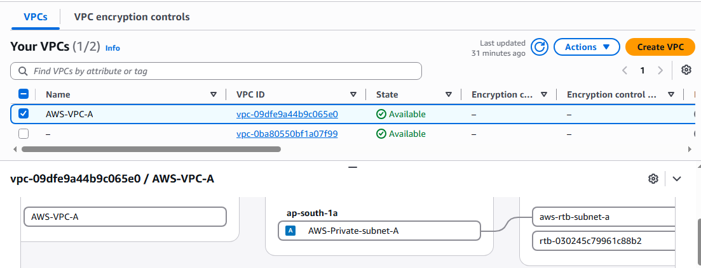

### Step 2: Create the simulated on-prem VPC (N. Virginia)
- Create a VPC `DC-VPC` with CIDR `192.168.0.0/16`
- Add one **public subnet** `192.168.0.0/24` and one **private subnet** `192.168.100.0/24`
- Launch a plain **EC2 instance** (Amazon Linux 2023) in the **public subnet** with a **public IP** — name it `DC-VPN Server`. This is just a regular EC2 instance at this point; it doesn't become a functioning VPN endpoint until you install and configure **Libreswan** on it in **Step 6**
- Note: since this instance will forward traffic between two networks instead of just handling its own, you'll need to **disable Source/Destination Check** on it later (covered in **Step 8**)
- Launch **EC2-B** (Amazon Linux 2023) in the private subnet with a **private IP only**

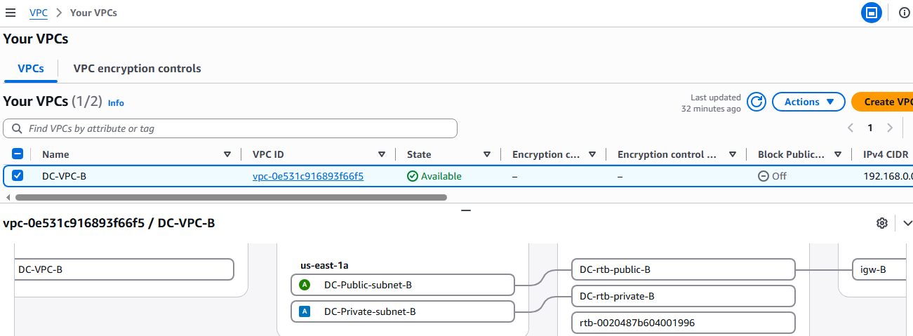

>  **All three EC2 instances (EC2-A, DC-VPN Server, EC2-B) are created here in Steps 1–2, before any VPN-specific AWS resources exist.** Steps 3–4 create the AWS-side VPN resources (VGW, Customer Gateway, VPN Connection), and Step 6 is where the "DC-VPN Server" instance is actually configured to act as a VPN endpoint via Libreswan.

### Step 3: Create a Virtual Private Gateway (VGW)
- In the **Mumbai** region, go to the **VPC Console → Virtual Private Gateways → Create Virtual Private Gateway**
- Give it a name tag (e.g. `AWS-VGW`), leave the ASN as **Amazon default ASN**, and click **Create**
- Select the newly created VGW, click **Actions → Attach to VPC**, and choose `AWS-VPC`
- Update the AWS-VPC private subnet's route table: add a route for `192.168.0.0/16` → target the VGW

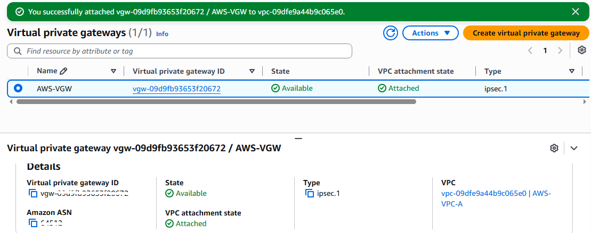

### Step 4: Create a Customer Gateway (CGW) and VPN Connection
- In the Mumbai region, go to **VPC Console → Customer Gateways → Create Customer Gateway** and fill in:
  - **Name tag** (optional): e.g. `DC-CGW-NV`
  - **BGP ASN:** leave as the default `65000` (not used for static routing, but AWS requires a value)
  - **IP address:** the DC-VPN Server's public IP
  - Leave **Certificate ARN**, **Device**, and **Tags** blank (all optional)
  - Click **Create customer gateway**
- Go to **VPC Console → Site-to-Site VPN Connections → Create VPN Connection** and fill in:
  - **Name tag:** `S2S-Mu-NV`
  - **Target gateway type:** Virtual Private Gateway → select the VGW created in Step 3
  - **Customer gateway:** Existing → select the CGW created above
  - Scroll down on the same **Create VPN Connection** page — after the Customer Gateway section, you'll find a **Routing options** field. Select **Static**, then a **Static IP Prefixes** box appears just below it — enter the DC-VPC CIDR `192.168.0.0/16` there and click **Add**
  - Leave the remaining settings (tunnel options, pre-shared keys) as default — AWS auto-generates them, and you'll retrieve them in the config file in Step 5
  - Click **Create VPN Connection**

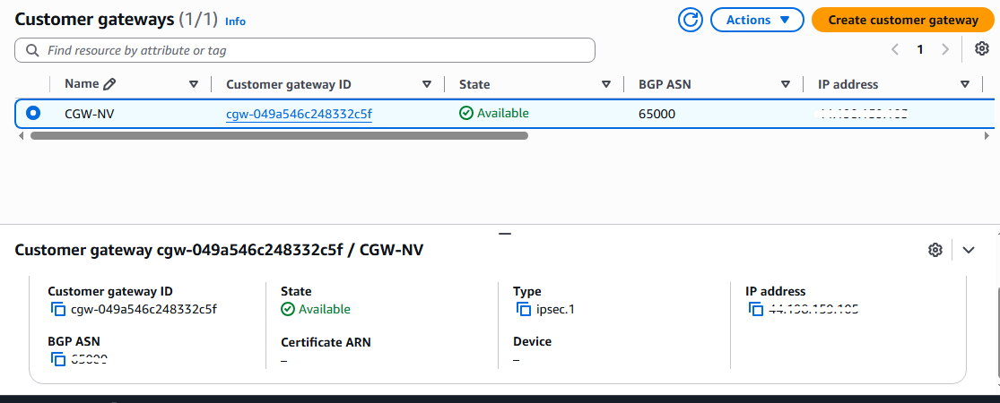

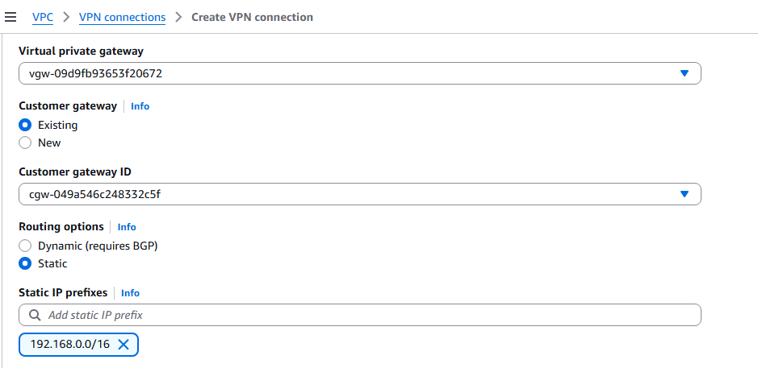

### Step 5: Download the VPN configuration file
- From the VPN connection console in Mumbai, download the configuration file for **Openswan** as the vendor (this is compatible with Libreswan)

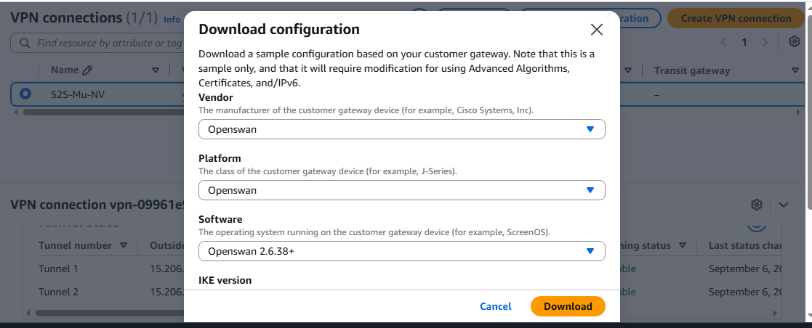

### Step 6: Install and configure Libreswan on the DC-VPN Server
SSH into the DC-VPN Server, then install Libreswan:

```bash
sudo yum install libreswan -y
```

**a) Enable IP forwarding.** Open `/etc/sysctl.conf` and make sure these three lines are present (add them if they're missing — a fresh Amazon Linux instance won't have them by default):

```conf
net.ipv4.ip_forward = 1
net.ipv4.conf.default.rp_filter = 0
net.ipv4.conf.default.accept_source_route = 0
```

Apply the change:

```bash
sudo sysctl -p
```

**b) Confirm ipsec.conf loads your tunnel configs.** Open `/etc/ipsec.conf` and make sure this line is **not** commented out (remove the leading `#` if it is):

```conf
include /etc/ipsec.d/*.conf
```

**c) Create the tunnel config.** The downloaded file gives you config for two tunnels (AWS provisions two for redundancy). For this demo, **only Tunnel1 is required** — configure just that one and leave Tunnel2 unused. Create `/etc/ipsec.d/aws.conf` and add:

```conf
conn Tunnel1
        authby=secret
        auto=start
        left=%defaultroute
        leftid=<DC_VPN_SERVER_PUBLIC_IP>      # Your DC-VPN Server's public IP
        right=<AWS_VGW_TUNNEL1_PUBLIC_IP>     # First AWS VGW tunnel public IP (from downloaded file)
        type=tunnel
        ikelifetime=8h
        keylife=1h
        phase2alg=aes128-sha256               # Updated value
        ike=aes128-sha256;modp2048            # Updated value
        keyingtries=%forever
        keyexchange=ike
        leftsubnet=192.168.0.0/16             # DC-VPC network CIDR
        rightsubnet=10.0.0.0/16               # AWS-VPC network CIDR
        dpddelay=10
        dpdtimeout=30
        dpdaction=restart_by_peer
```

> **Important changes from the default downloaded file:**
> - Remove the line `auth=esp` entirely — it's not needed and will cause a configuration error
> - Update `phase2alg` and `ike` to the values shown above for compatibility
> - Update `leftsubnet` and `rightsubnet` to match your actual VPC CIDRs (the downloaded file has `<LOCAL NETWORK>` / `<REMOTE NETWORK>` placeholders)

**d) Add the pre-shared key.** Create `/etc/ipsec.d/aws.secrets` and add a line for Tunnel1, in this exact format (space-separated, matching the `leftid` and `right` values above):

```
<DC_VPN_SERVER_PUBLIC_IP> <AWS_VGW_TUNNEL1_PUBLIC_IP>: PSK "<tunnel1-psk-from-downloaded-file>"
```

Both the tunnel IP and the PSK are unique to your VPN connection — copy them exactly from your downloaded configuration file, don't reuse the values shown here.

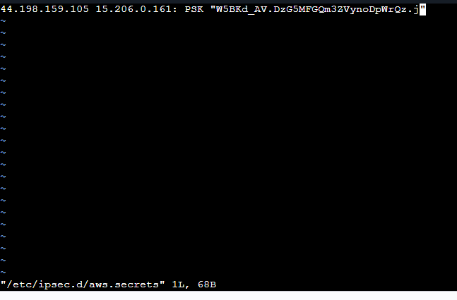

Start the IPSec service:

```bash
sudo systemctl start ipsec.service
```

Check that it's running:

```bash
sudo systemctl status ipsec.service
```

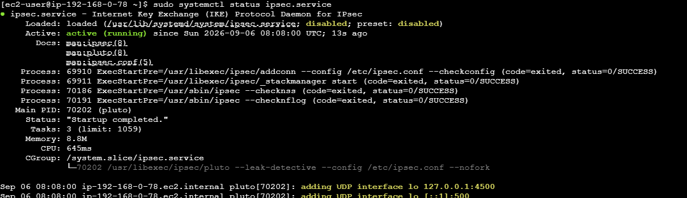

### Step 7: Verify the tunnel is up
- In the Mumbai region's VPN connection console, check the tunnel status — **one of the two IPSec tunnels should show "UP"**
- From the DC-VPN Server, try to ping EC2-A's private IP — it should succeed

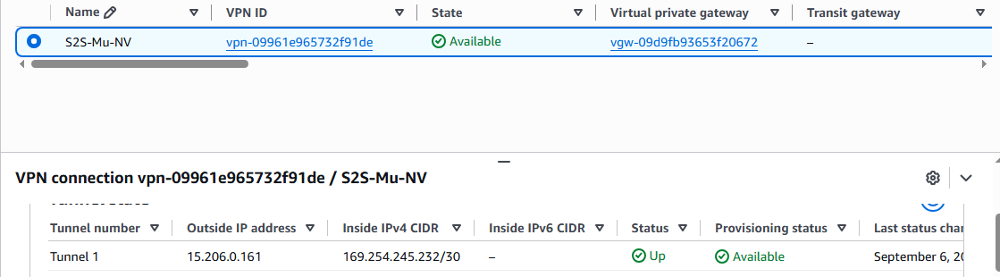

### Step 8: Enable routing through the DC-VPN Server
- On the DC-VPN Server instance, **disable Source/Destination Check** (EC2 console → Actions → Networking → Change source/destination check)
- Update EC2-B's private subnet route table: add a route for `10.0.0.0/16` → target the DC-VPN Server's network interface (ENI)
  - **Why:** EC2-B has no direct connection to AWS-VPC — only the DC-VPN Server does, via the IPSec tunnel. This route tells EC2-B to send any traffic destined for `10.0.0.0/16` (the AWS-VPC CIDR, where EC2-A lives) to the DC-VPN Server first, which then forwards it through the tunnel. Without this route, EC2-B wouldn't know how to reach EC2-A at all.
 - **How to add it:** go to EC2-B's subnet route table → **Edit routes** → **Add route** → Destination: `10.0.0.0/16` → Target dropdown: select **Network Interface**, then choose the DC-VPN Server's ENI from the list (confirm the ID matches by running `ip addr show` on the DC-VPN Server — it appears as an `altname`, e.g. `eni-xxxxxxxx`) → **Save changes**

*Source/Destination check disabled on DC-VPN Server and EC2-B route table updated*
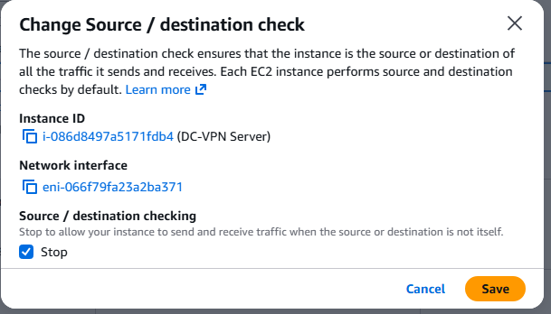

*Ping successfull from DC-VPN Server to EC2A AWS server*
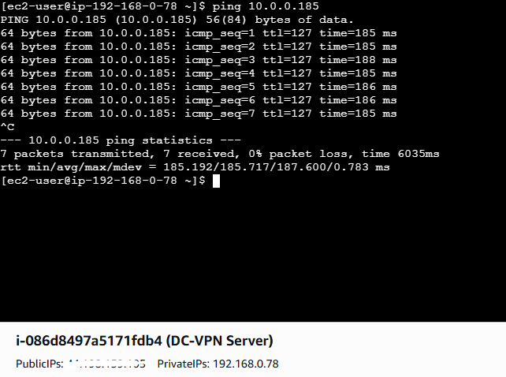

### Step 9: Test end-to-end connectivity
- SSH into EC2-B via the DC-VPN Server (as a jump host). EC2-B has no public IP, so you can't reach it directly from your laptop 
  - **Manually, in two hops:** first SSH into the DC-VPN Server, then SSH from there into EC2-B:
    ```bash
    ssh ec2-user@<DC_VPN_SERVER_PUBLIC_IP>
    # once connected to the DC-VPN Server:
    ssh ec2-user@<EC2-B_PRIVATE_IP>
    ```
    (This requires copying your private key onto the DC-VPN Server first, or using `ssh -A` from your local machine to forward your local key instead.)

*Successful ping/SSH from DC-VPN Server to EC2-B confirming end-to-end VPN connectivity*
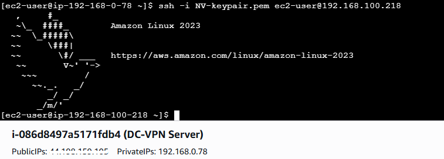

- Try to ping or SSH into EC2-A — it should succeed, confirming that traffic is flowing securely through the VPN tunnel between the two private networks

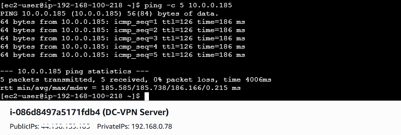

**If the ping/SSH to EC2-A doesn't work, check these in order — they cover the vast majority of failures:**

1. **Is the tunnel actually UP?** Recheck the VPN connection console in Mumbai. If neither tunnel shows "UP," the problem is upstream of routing — go back to Step 6/7 and check `sudo ipsec status` and `sudo systemctl status ipsec.service` on the DC-VPN Server for errors (mismatched PSK, wrong tunnel IP, or a typo in `aws.conf` are the usual culprits).
2. **Is Source/Destination Check disabled on the DC-VPN Server?** (Step 8) If it's still enabled, AWS silently drops any packet the instance tries to forward that isn't addressed to itself.
3. **Are both route tables correct — and pointing at the *right* ENI?**
   - AWS-VPC private subnet (EC2-A's subnet): route for `192.168.0.0/16` → VGW
   - DC-VPC private subnet (EC2-B's subnet): route for `10.0.0.0/16` → DC-VPN Server's ENI/instance
   - DC-VPC public subnet (DC-VPN Server's subnet): route for `10.0.0.0/16` isn't needed here — but confirm `192.168.0.0/16` → Local and `0.0.0.0/0` → Internet Gateway are both present
   - **This is a common silent failure point:** the route can look completely valid (a real ENI ID, "Active" status) while actually pointing at the *wrong* interface — for example if it was set to an ID that isn't the DC-VPN Server's current ENI. This won't show any error anywhere; traffic from EC2-B just silently never arrives at the VPN server. Confirm the ENI ID in the route table matches the one shown by `ip addr show` on the DC-VPN Server itself (look for the `eni-...` altname).
4. **Do the security groups allow the traffic?** EC2-A's SG must allow ICMP/SSH **from `192.168.0.0/16`** (not just from EC2-B's specific IP) since traffic arrives via the VGW, not directly from EC2-B.
5. **Which hop is failing?** Test incrementally rather than jumping straight to EC2-B → EC2-A:
   - Can you SSH into the DC-VPN Server from your laptop? (confirms public-side connectivity)
   - Can you ping EC2-A **from the DC-VPN Server itself**? (this is Step 7 — if this fails, the problem is the tunnel/VGW, not EC2-B's routing)
   - Can you SSH from the DC-VPN Server into EC2-B? (confirms DC-VPC internal routing)
   - Only once both of those work should EC2-B → EC2-A be attempted
6. **Amazon Linux firewall:** confirm nothing is blocking ICMP locally on EC2-A (`sudo iptables -L` — Amazon Linux 2023 has no firewall enabled by default, but worth a quick check if you've made other changes to the instance)


## Security Group & Route Table Reference

| Location | Rule | Source |
|---|---|---|
| AWS-VPC (EC2-A) | Allow SSH (22), ICMP | `192.168.0.0/16` |
| DC-VPC public subnet (DC-VPN Server) | Allow SSH (22), ICMP | `0.0.0.0/0` |
| DC-VPC private subnet (EC2-B) | Allow SSH (22) from `192.168.0.0/16`, ICMP from `10.0.0.0/16` | — |

| Route Table | Destination | Target |
|---|---|---|
| AWS-VPC private subnet | `10.0.0.0/16` | Local |
| AWS-VPC private subnet | `192.168.0.0/16` | VGW |
| DC-VPC public subnet | `192.168.0.0/16` | Local |
| DC-VPC public subnet | `0.0.0.0/0` | Internet Gateway |
| DC-VPC private subnet | `192.168.0.0/16` | Local |
| DC-VPC private subnet | `10.0.0.0/16` | DC-VPN Server ENI |

## Cleanup

To avoid ongoing charges, remove resources in this order once you're done:

1. Terminate all EC2 instances (EC2-A, DC-VPN Server, EC2-B)
2. Delete the VPN Connection
3. Dissociate the Virtual Private Gateway from the VPC
4. Delete the Virtual Private Gateway
5. Delete the Customer Gateway
6. Delete `AWS-VPC`
7. Delete `DC-VPC`

## Key Concepts Learned

- **Virtual Private Gateway (VGW):** The AWS-side endpoint of a VPN connection, attached to a VPC
- **Customer Gateway (CGW):** Represents the on-prem/remote-side VPN endpoint in AWS's configuration
- **Static vs. Dynamic (BGP) routing:** This lab uses static routes, meaning route propagation must be configured manually rather than negotiated automatically
- **IPSec tunnels:** AWS provisions two redundant tunnels per VPN connection for high availability — only one needs to be "UP" for traffic to flow
- **Libreswan:** An open-source IPSec VPN implementation used here to simulate a real on-prem VPN router

---
*Based on a hands-on lab exercise for practicing AWS Site-to-Site VPN concepts using Libreswan.*
